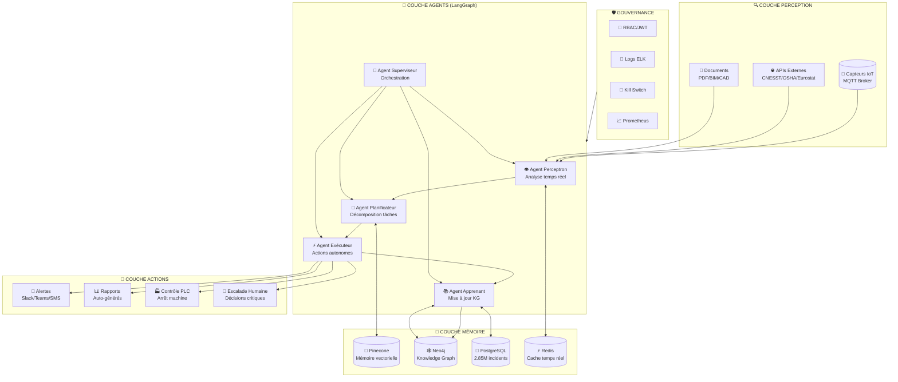
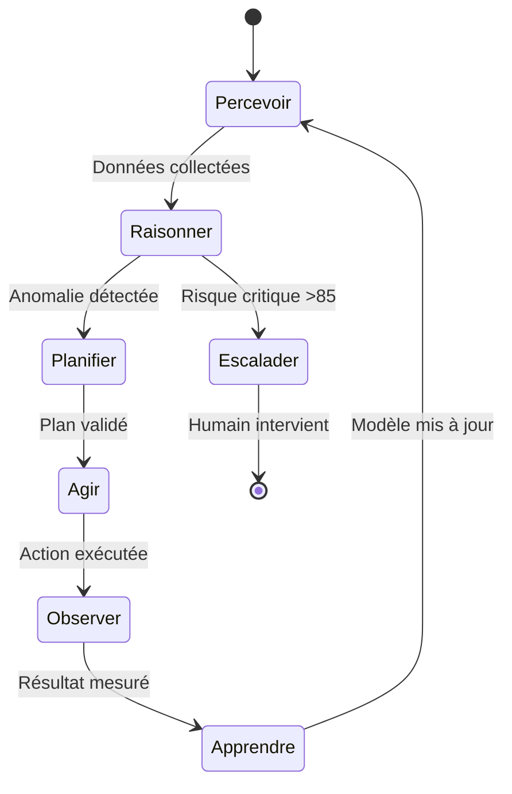
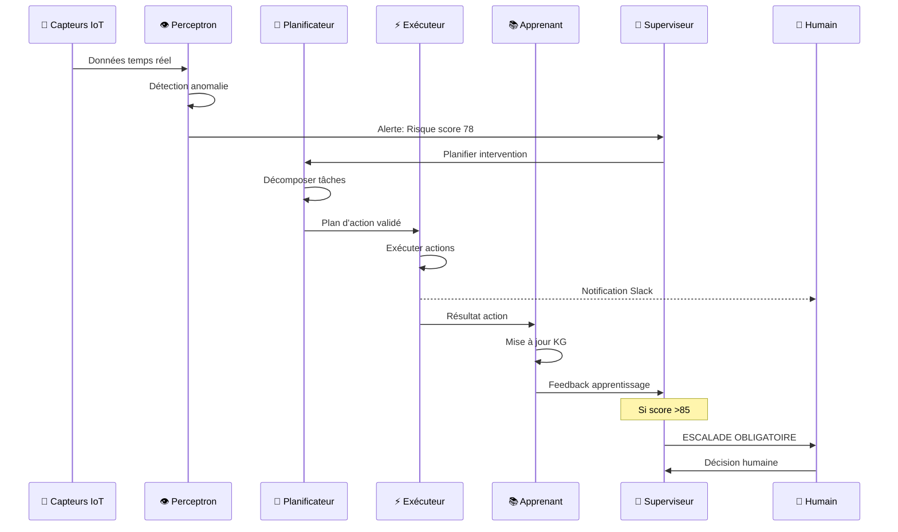

# 🏗️ ARCHITECTURE SAFETWIN X5 AGENTIQUE

## Diagramme Principal

## Boucle ReAct (Reason-Act-Observe)

## Flux Multi-Agents

## Niveaux d'Autonomie (LOA)

| LOA | Description | SafeTwin X5 |
|-----|-------------|-------------|
| 1 | Assistance humaine | ❌ Dépassé |
| 2 | Assistance partielle | ❌ Dépassé |
| 3 | Autonomie conditionnelle | ❌ Dépassé |
| **4** | **Haute autonomie** | ✅ **CIBLE** |
| 5 | Autonomie totale | ⚠️ Futur (avec validation) |

### LOA 4 = Agent autonome AVEC :
- Escalade humaine si risque >85
- Kill switch accessible
- Audit complet des décisions
- Supervision dashboard temps réel
